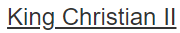

# Web History

## Description
Web History offers a dynamic exploration of historical events, blending accuracy with immersive storytelling. Our platform enriches your understanding of the past through meticulously detailed narratives, a curated gallery of historical images, and engaging educational videos.

## Table of Contents
- [Installation](#installation)
- [Issues](#issues)
- [Validation](#validation)
- [Usage](#usage)
- [Features](#features)
- [Contributing](#contributing)

## Installation
To install the website on your local machine, follow these steps:
1. Clone the repository to your local machine.
2. Navigate to the project directory.
3. Open the `index.html` file in a web browser.

## Issues
Challenges Encountered:
1. **CSS Responsiveness**: Initially, multiple CSS files led to small inconsistent responsiveness across different pages.
2. **HTML Validation**: Encountered a W3C validation error related to the `charset` attribute placement.
   - Error: "A charset attribute on a meta element found after the first 1024 bytes."
   - Context: The error occurs in `Member.html`. Removing content from lines 33 to 67 resolves the issue, but this section is retained for aesthetic appeal until a solution is found.
   - 
3. **Design Consistency**: The navigation bar experiences alignment issues on smaller screens.
   - 
   - 
4. **Links In Text**: The links in the text are invisable unless you hover the mouse over the word
    - 
    - 

## Validation
- CSS validation is successful across all pages.
 - 
- HTML validation passes with the suggested modification in `Member.html`.

## Usage
Navigate the site using the top menu:
  
- **Home**: Explore the main page, featuring key historical links.
- **Gallery**: Discover a world of historical images and artifacts.
- **About**: Dive into our project's mission and objectives.
- **Sign Up**: Join our community for regular updates and active discussions.

## Features
- **Responsive Design**: Seamlessly adapts to various screen sizes.
- **Aesthetic Appeal**: Harmonious color scheme enhancing user experience.
  
- **Interactive Gallery**: Engage with high-definition historical imagery.
>
- **Rich Historical Content**: Detailed accounts backed by credible sources.
- **Membership Functionality**: Easy sign-up for interactive user participation.
  

## Contributing
Your insights and contributions are valuable to us! To contribute:
1. Fork the repository.
2. Create a new branch: `git checkout -b feature-branch`
3. Commit your changes: `git commit -am 'Add some feature'`
4. Push to the branch: `git push origin feature-branch`
5. Submit a pull request.

## Acknowledgments
I acknowledge and take full responsibility that this is my own work, and what I borrowed from other repositories is written down as comments in the code.